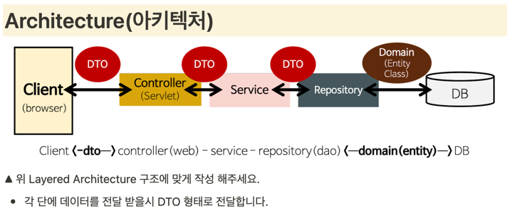
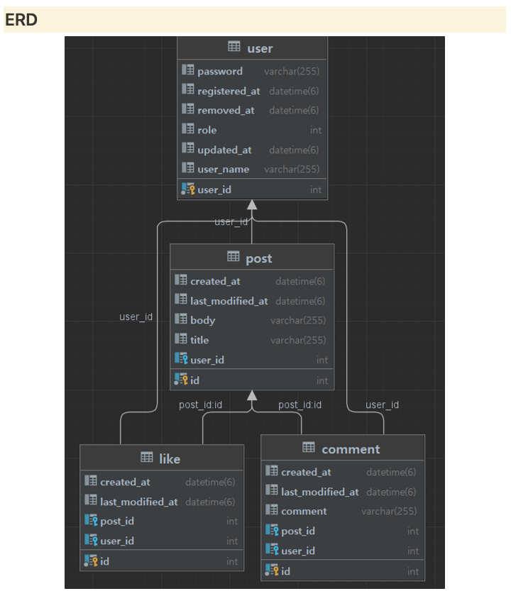

# Final Project - MutsaSNS
- Swagger
  - http://ec2-15-164-170-150.ap-northeast-2.compute.amazonaws.com:8080/swagger-ui/

## 프로젝트 소개
멋쟁이 사자처럼 백엔드스쿨 2기 개인 프로젝트
 - 회원 인증,인가
 - 글쓰기
 - 피드
 - 댓글
 - 좋아요
 - 알림

## 아키텍처 

## ERD

## 1일차(22.12.20)

- GitLab 프로젝트 빌드
- Swagger UI 적용
- ec2 Docker 세팅
- CI/CD 구성

## 2일차(22.12.21)

- Join 구현
- Login 구현
